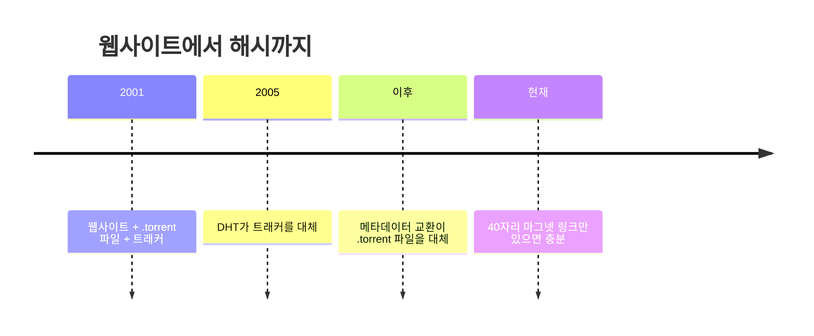

# 비트토렌트: 모든 다운로더를 서버로 바꾼 마법, 그 7가지 비밀

안녕하세요! 10년 차 IT 실무자이자 테크 블로거, 오늘 여러분과 함께 흥미로운 주제를 파헤쳐 볼 김만세입니다. 지난 포스트에서 [XOR 거리](https://dev.to/lovestaco/bitwise-and-otherwise-understanding-xor-distance-1kh8)에 대해 깊이 탐구하고, 이를 이용해 [Kademlia](https://dev.to/lovestaco/kademlia-algo-that-turned-xor-distance-into-a-network-1g3l)라는 놀라운 DHT 알고리즘을 구축했었죠. Kademlia는 디렉터리 없이도 네트워크 안에서 무엇이든 찾아낼 수 있게 해주는 마법 같은 기술입니다.



당시 제가 "이 알고리즘은 비트토렌트(BitTorrent), IPFS, 이더리움 등 곳곳에 숨어 있다"고 약속드렸는데, 드디어 오늘 그 약속을 지키는 날입니다.

오늘은 비트토렌트를 조각조각 해체해 보면서, Kademlia가 어떻게 그 핵심에 스며들어 있는지 밝혀낼 겁니다. 옆문으로 살며시 들어오는 Kademlia의 모습을 발견하게 되실 거예요.

시작하기 전에 재밌는 사실 하나. 레딧(Reddit)에서는 2001년 브람 코헨(Bram Cohen)이 파이썬으로 혼자 비트토렌트를 만들었는데, 그가 사실 사토시 나카모토(Satoshi Nakamoto)라는 의심스러운 주장을 하는 사람들이 꽤 많습니다. 제가 "그게 사실이다!"라고 말하는 건 아닙니다. 다만 이 글을 끝까지 읽으시면 왜 사람들이 그런 말을 하는지 고개를 끄덕이게 될 겁니다.

## 불가능해 보였던 그 숫자, 35%의 비밀

2004년, CacheLogic이라는 측정 기관은 당시 전체 인터넷 트래픽의 무려 35%가 비트토렌트 하나로 발생한다고 보고했습니다. 다른 모든 P2P 네트워크를 합친 것보다도 많았고, 심지어 전체 웹 트래픽보다도 많았습니다.

프로토콜 하나가, 한 사람이 만들었는데, 회사도 없고, 데이터센터도 없고, "BitTorrent Inc"라고 적힌 랙에 꽂힌 서버도 없이 말이죠.

마지막 부분이 이 모든 이야기의 핵심입니다. 여러분이 지금까지 작업했던 "일반적인" 시스템들은 보통 돈을 들이부어서 스케일합니다. 더 좋은 장비, 더 많은 복제본, CDN을 앞에 두는 식이죠.

하지만 비트토렌트는 그 누구도 돈을 쓸 사람이 없었습니다. 그래서 용량, 신뢰, 스케줄링, 인센티브, 발견 등 모든 어려운 문제들이 *프로토콜 그 자체 안에서* 해결되어야만 했습니다. 제가 현업에서 수많은 시스템을 다뤄봤을 때, 이처럼 제약된 환경에서 혁신적인 해법이 나오는 경우가 종종 있는데, 비트토렌트가 바로 그런 대표적인 사례입니다.

## 문제 1: 클라이언트-서버의 한계, 슬래시닷 효과

2001년에 파일을 배포한다는 건 서버 하나, 업링크 하나를 의미했고, 모든 다운로드는 그 업링크의 한 조각을 갉아먹는 식이었습니다. 용량은 고정되어 미리 할당되지만, 수요는 그렇지 않죠.

만약 인기가 많은 곳에 링크가 걸리면, 당시 사람들이 문자 그대로 "[슬래시닷 효과](https://en.wikipedia.org/wiki/Slashdot_effect)"라고 불렀던 상황을 맞이하게 됩니다. 서버가 가장 많은 사람들이 무언가를 원할 때 정확히 과부하에 걸리는 현상이죠.


결국 우리는 "독약을 고르는" 딜레마에 빠집니다. 대부분의 날에 아무도 사용하지 않을 용량에 돈을 낭비하는 '과잉 프로비저닝'을 하거나, 아니면 정말 중요한 날 서비스 중단이라는 '과소 프로비저닝'을 감수해야만 했습니다.

## 발상의 전환: 당신의 다운로드가 곧 다른 사람의 업로드

여기 비트토렌트의 실제 트릭이 있습니다. 말로 하면 너무나 간단해서 거의 모욕적으로 느껴질 정도입니다. **파일을 다운로드하는 모든 피어가 동시에 파일의 소스가 됩니다.** 선택 사항이 아닙니다. "공유하고 싶으면 하세요"도 아닙니다. 프로토콜 자체에 내장된 기능입니다.

그래서 파일은 조각(일반적으로 256KB에서 몇 MB)으로 나뉩니다. 원본 시더(Seeder)는 각 바이트를 스웜(swarm)에 *단 한 번만* 밀어 넣으면 됩니다. 그 후로는 피어들이 서로에게 복제합니다. 전체 용량은 모든 피어의 업링크를 합친 것이 됩니다. 즉,


일반 서버를 다운시킬 플래시 크라우드(Flash Crowd) 현상이 비트토렌트 스웜은 오히려 *더 빠르게* 만듭니다. 더 많은 다운로더가 있으면 더 많은 업로더가 생기고, 이는 곧 더 많은 용량으로 이어집니다. 제가 아는 한 트래픽 급증이 사고가 아니라 해결책이 되는 유일한 시스템이죠. 이 부분이 제가 실무에서 겪었던 병목 현상을 해결하는 데 영감을 주기도 했습니다.

파일을 조각 내는 것은 또한 무료로 병렬성을 제공합니다. 느린 파이프 하나를 기다리는 대신 여러 피어로부터 다른 조각들을 동시에 가져오고, 조각이 검증되는 순간 바로 다시 다른 피어들에게 제공할 수 있습니다. 전체 다운로드가 끝나기를 기다리지 않고, 참여하는 순간부터 몇 초 안에 소스가 되는 셈입니다.

하지만 클라이언트-서버의 이런 급진적인 역전은 즉시 세 가지 새로운 문제를 발생시키는데, 여기서부터 비트토렌트의 진정한 영리함이 드러납니다.

## 문제 2: 낯선 사람의 바이트를 어떻게 믿을 것인가?

익명의 피어가 파일의 조각을 전달한다면, 악의적이거나 단순히 버그가 있는 사람이 쓰레기 데이터를 넘겨주는 것을 무엇으로 막을까요? 발신자를 인증할 수는 없습니다. 피어들은 서로 교환 가능하고 익명이어야 합니다. 그것이 분산화의 핵심이니까요.

그래서 비트토렌트는 발신자를 전혀 인증하지 않습니다. 대신 *콘텐츠를 검증*합니다.

모든 조각은 `.torrent` 파일에 SHA-1 해시가 나열되어 있으며, 이는 파일을 처음 공유한 사람이 계산한 것입니다. 여러분은 수신한 데이터를 로컬에서 해시하여 비교합니다.


아무도 평판, 계정 또는 "인증된 피어" 체크마크가 필요 없습니다. 데이터가 스스로를 증명하기 때문입니다. 이 아이디어 하나만으로도 여러분의 시스템에 적용할 가치가 있습니다. 콘텐츠가 스스로를 검증할 수 있다면, 신뢰할 수 없는 미러, 미심쩍은 캐시, 심지어 임의의 피어 등 *어디에서든* 가져올 수 있습니다. 저도 실제로 수많은 CDN이나 미러링 시스템을 구축하면서 이 '내용으로 자신을 증명'하는 방식이 얼마나 강력한지 직접 체감했습니다.

## 문제 3: 어떤 조각을 다음으로 다운로드해야 하는가?

순진한 답변: 1번 조각, 그다음 2번, 그다음 3번, 순서대로. 너무나 당연하게 들립니다. 하지만 세 가지 이유로 엄청난 재앙이 됩니다.

**첫째**, 모두가 같은 순서로 다운로드하면, 모든 사람이 똑같은 초기 조각들만 가지게 되고, 다른 사람들이 필요로 하는 조각은 아무도 가지고 있지 않게 됩니다. 트레이딩이 일어나지 않고, 마치 모두가 똑같은 트럼프 카드를 들고 있는 방에 모여 있는 것과 같습니다.

**둘째**, *나중* 조각에 대한 요청은 모두 파일을 처음 시드(seed)한 사람에게만 몰리게 됩니다. 왜냐하면 그들만이 그 조각들을 가지고 있기 때문입니다. 축하합니다! 병목 현상을 피하기 위해 만든 시스템 내부에 다시 병목 현상을 재현했습니다.

**셋째**, 그리고 이 점이 치명적입니다. 만약 원본 시더가 다른 누구도 나중 조각들을 다운로드하기 전에 사라져 버린다면, 그 조각들은 세상 어디에도 존재하지 않게 됩니다. 파일은 영원히 불완전한 상태로 남습니다. 만약 토렌트가 99%에서 영원히 멈춰 있는 것을 본 적이 있다면, 정확히 이 일이 일어난 것입니다.

비트토렌트의 해결책은 **가장 희귀한 조각 우선(rarest-first)** 방식입니다. 모든 클라이언트는 자신이 알고 있는 피어들 사이에서 각 조각이 얼마나 흔한지 추적하고, 항상 가장 희귀한 조각을 다음으로 가져옵니다. 단 하나의 예외는 맨 처음 조각입니다. 이 조각은 무작위로 선택되는데, 이는 새로운 피어가 즉시 트레이드할 *무언가*를 필요로 하고, 희귀한 조각은 정의상 얻기 느리기 때문입니다.


우아한 부분은 모든 피어가 기술적으로 *자신*의 이익이 아닌 *스웜의 건강*을 위해 최적화한다는 것입니다. 그리고 다운로드 기간 내내 이 두 가지 목표는 같은 것으로 수렴합니다. 이기적인 행동과 이타적인 행동이 하나의 전략으로 합쳐지는 거죠.

마지막에는 **엔드게임 모드(endgame mode)**라는 깔끔한 정리 메커니즘도 있습니다. 몇 개의 블록만 남으면, 클라이언트는 해당 블록을 가지고 있는 모든 피어에게 동시에 요청합니다. 가장 먼저 도착한 것이 승리하고, 나머지는 취소됩니다. 약간의 중복 트래픽은 저렴합니다. 99%에서 느린 피어 하나에 발목 잡히는 것은 그렇지 않습니다.

## 문제 4: 아무도 업로드를 강요하지 않는데?

업로드는 대역폭을 소모합니다. 종량제 인터넷에서는 실제 돈이 들 수도 있습니다. 순전히 이기적인 피어에게 가장 합리적인 행동은 모든 것을 다운로드하고 아무것도 업로드하지 않는 것입니다. 이를 **무임승차(free riding)**라고 하는데, 비트토렌트의 전신인 그누텔라(Gnutella)는 이 문제로 완전히 망가졌습니다.

2000년 연구에 따르면, 그누텔라 사용자 중 70%는 *아무 파일도 공유하지 않았으며*, 상위 1%의 호스트가 전체 응답의 거의 절반을 담당했습니다.

그누텔라의 "분산형" 네트워크는 결국 자원봉사자들에 의해 운영되는 클라이언트-서버 토폴로지로 조용히 변질되었는데, 실제 클라이언트-서버 설정이 주는 모든 보장은 사라진 최악의 경우였죠. 제가 실무에서 인센티브 설계를 고민해 봤을 때, 이런 미묘한 동기 부여의 실패가 시스템 전체를 무너뜨릴 수 있다는 점을 항상 경계합니다.


비트토렌트에는 계정도, 평판 시스템도, 중앙 집중적인 강제력도 전혀 없습니다. 그래서 게임 이론에서 차용한 **팃포탯(tit-for-tat)** 메커니즘을 통해 업로드를 빠른 다운로드의 *유일한* 경로로 만듭니다. (협력으로 시작한 다음 상대방을 모방하는 이 전략은 악셀로드의 죄수의 딜레마 토너먼트에서 유명하게 우승했었죠.)

모든 클라이언트는 몇 개의 업로드 슬롯(기본 4개)을 가집니다.

매 10초마다 클라이언트는 최근에 *자신에게* 업로드한 속도에 따라 연결된 피어들의 순위를 다시 매기고, 상위 4개는 언초크(unchoke, 막지 않음)하고 나머지는 모두 초크(choke, 막음)합니다. 빠르게 업로드하면, 보상을 받습니다. 아무것도 업로드하지 않으면, 이웃 피어 하나하나로부터 차단당합니다.

| 피어 속도 (KB/s) | 상태 |
|---|---|
| 950 | 언초크됨 |
| 720 | 언초크됨 |
| 540 | 언초크됨 |
| 310 | 언초크됨 |
| 120 | 초크됨 |
| 60 | 초크됨 |
| 0 | 초크됨 |

하지만 여기에는 명백한 허점이 있습니다. 새로운 피어는 조각이 하나도 없으므로 아무것도 업로드할 수 없고, 그래서 모든 피어가 그를 초크합니다. 그럼 새로운 피어는 거래를 시작할 첫 조각을 결코 얻을 수 없겠죠.

순수한 팃포탯은 아무도 부트스트랩할 수 없습니다.

이 문제의 해결책은 **낙관적 언초크(optimistic unchoke)**입니다. 매 30초마다 각 클라이언트는 업로드 슬롯 하나를 완전히 무작위 피어에게 제공합니다. 속도 평가는 완전히 무시됩니다. 이 무작위 슬롯은 새로운 피어가 첫 조각을 얻고 상호 협력 루프에 진입하는 방법입니다. 또한 이는 은밀한 탐색 메커니즘이기도 합니다. 때로는 그 무작위 낯선 피어가 현재 상위 4개 피어보다 빠르다는 것이 밝혀져, 실력으로 영구 슬롯을 차지하기도 합니다.

강화 학습에서 바로 튀어나온 '탐색/활용(Explore/Exploit)' 전략이 2001년 프로토콜 내에서 조용히 실행되고 있었던 셈이죠.


## 발견: 마지막 남아있던 중앙 관리 지점마저 없애다

이 시점까지 비트토렌트는 여전히 하나의 중앙 집중식 요소에 의존했습니다. 바로 **트래커(tracker)**였습니다. 트래커는 새로운 피어에게 연결할 약 40개의 주소 목록을 제공하는 서버였습니다. 작은 역할이었지만, 기술적으로(서버 다운 시 스웜이 새 멤버를 찾을 수 없음)나 법적으로(트래커는 운영자, 주소, 호스팅 비용이 있었고 끊임없이 폐쇄당함) 단일 장애 지점이었습니다.

그래서 2005년, 비트토렌트는 제 지난 포스트에서 다뤘던 바로 그 알고리즘인 [Kademlia](https://dev.to/lovestaco/kademlia-algo-that-turned-xor-distance-into-a-network-1g3l)를 기반으로 구축된 **메인라인 DHT(Mainline DHT)**를 발표했습니다. 모든 노드는 무작위 160비트 ID를 선택합니다. 모든 토렌트 역시 이미 160비트 ID, 즉 메타데이터의 SHA-1 해시인 **인포해시(infohash)**를 가지고 있습니다.

Kademlia의 규칙은 즉시 발동합니다. 인포해시와 *가장 가까운* ID를 가진 노드들이 해당 토렌트의 피어 목록을 저장하는 책임을 맡게 됩니다. 어떤 코디네이터도 이를 할당하지 않으며, 우리가 이미 다뤘던 XOR 거리 계산에 따라 자연스럽게 결정됩니다.


마지막으로 남아있던 중앙 집중식 유물은 여전히 웹사이트에서 다운로드되던 `.torrent` 파일 그 자체였습니다. 나중에 메타데이터 교환(metadata exchange)이라는 확장 기능이 추가되어, 피어들이 해당 메타데이터를 다른 조각들처럼 인포해시에 대해 검증하며 조각 단위로 주고받을 수 있게 되었습니다. 이는 스웜에 참여하는 데 필요한 *유일한* 것이 40자리의 인포해시라는 것을 의미합니다. 이것이 바로 **마그넷 링크(magnet link)**입니다.

```plaintext
magnet:?xt=urn:btih:a94f6c3b2e8d1a9f0c7e4b8d3a1f6c9e0b2d7f83
```

이 한 줄의 문자열은 완전히 콘텐츠 주소 지정(content addressed) 방식입니다.


서버를 가리키는 것이 아니라 *데이터 자체*를 가리키며, 전 세계 어느 노드든 이 데이터를 가지고 있다면 여러분에게 제공할 수 있습니다. 미스트랄(Mistral AI) 같은 AI 연구소가 수백 기가바이트에 달하는 오픈 가중치 모델을 40자리 문자열 트윗 하나로 배포하는 이유가 바로 이것입니다.

수년에 걸쳐 종속성 체인이 사라지는 과정을 보세요.



## 혼잡: 누군가의 Zoom 통화를 끊는 원인이 되지 마세요

초기 비트토렌트에는 아무도 예측하지 못했던 부작용이 있었습니다. 같은 연결에서 실행되는 화상 통화나 게임을 망가뜨렸는데, 이는 순수한 대역폭 부족 문제가 아니었습니다.

TCP는 링크의 용량을 *실험적*으로 파악합니다. 패킷 손실이 발생할 때까지 점점 더 빠르게 전송하면서 말이죠. 문제는 홈 라우터가 패킷 손실이 발생하기 전에 패킷을 버퍼링한다는 점입니다.

비트토렌트 클라이언트는 동시에 수십 개의 TCP 연결을 열어두므로, 그 버퍼들은 완전히 채워져 계속 가득 찬 상태를 유지합니다. 그러면 화상 통화를 포함한 연결의 모든 패킷은 그 큐에서 대기하게 됩니다.

이를 **버퍼블로트(bufferbloat)**라고 하며, 이로 인한 큐잉 지연은 링크가 기술적으로 "가득 차지 않았음"에도 불구하고 수 초까지 부풀어 오를 수 있습니다.


2009년경 출시된 해결책은 **uTP**라는 전송 프로토콜과 **LEDBAT**이라는 혼잡 제어 알고리즘을 결합한 것입니다. 패킷 손실을 기다리는 대신, 모든 패킷에 타임스탬프를 담고, 편도 큐잉 지연이 약 100ms를 넘는 순간 발신자는 속도를 줄입니다. 버퍼가 실제로 채워지기 *전에* 그리고 통화가 끊기기 *전에* 말이죠.

```plaintext
rate += gain × (100ms − measured_delay)
```

이 기법의 기발한 점은 일반 TCP는 설계상 더 공격적이기 때문에, 실제 트래픽이 나타나면 uTP는 의도적으로 양보하고 남은 대역폭만 채운다는 것입니다. 대역폭을 독점하는 대신, 적절한 백그라운드 작업처럼 동작합니다. 이 아이디어는 IETF에 의해 [LEDBAT (RFC 6817)](https://www.rfc-editor.org/rfc/rfc6817)으로 표준화되었고, 현재 Windows Update와 Apple의 소프트웨어 업데이트 파이프라인에도 탑재되어 있습니다. 여러분의 토렌트 클라이언트의 '매너'가 이제 운영체제 기능이 된 것이죠.

## 현재 이 아키텍처는 어디에서 실행될까?

정확히 동일한 아키텍처가 여러분이 아마도 사용했을 만한 여러 곳에서 조용히 실행되고 있습니다.


*   **Windows Update:** 수백만 대의 PC에 업데이트를 배포하는 데 사용됩니다.
*   **Uber의 배포 파이프라인:** 차량 내 소프트웨어 배포에 활용됩니다.
*   **블리자드(Blizzard) 게임:** 대용량 게임 클라이언트 및 업데이트 배포에 사용됩니다.
*   **IPFS (InterPlanetary File System):** 분산 웹의 핵심 프로토콜입니다.
*   **Ethereum 2.0 (Merge 이후):** 피어 간 데이터 동기화에 Kademlia와 유사한 DHT를 사용합니다.

## 그렇다고 공짜는 아니다

이렇게 영리한 아이디어라도 트레이드오프 없이는 불가능합니다. 비트토렌트에는 여러분이 아이디어를 통째로 가져가기 전에 알아야 할 몇 가지 실제적인 단점이 있습니다.

*   **프라이버시 없음:** 다운로드하려면 자신을 공개해야 합니다. 따라서 스웜의 어떤 참여자든 자신이 본 모든 IP 주소를 기록할 수 있습니다.
*   **지연 시간보다 처리량:** 희귀 조각 우선(rarest-first) 방식은 순차적 방식과 정반대입니다. 이는 시청자가 *지금 당장* 필요한 조각이 스웜이 현재 우선시하는 조각과 일치하지 않기 때문에 스트리밍에는 적합하지 않습니다.
*   **가용성은 수요에 따름:** 플래시 크라우드가 사라지면, 파일의 생존은 오로지 자원봉사자들이 계속 시드(seed)하는지에 달려 있습니다.
*   **개방된 멤버십은 양날의 검:** DHT는 어떤 노드든 허용합니다. 여기에는 수천 개의 가짜 ID를 실행하여 조회 결과를 왜곡하거나 레코드를 오염시키는 공격자도 포함됩니다. 고전적인 [시빌 공격(Sybil attack)](https://en.wikipedia.org/wiki/Sybil_attack)이죠.


## 마무리하며

브람 코헨의 원본 글 제목은 문자 그대로 "[BitTorrent에서 인센티브가 견고함을 구축한다](http://www.bittorrent.org/bittorrentecon.pdf)"였습니다. 이 글에서 다룬 일곱 가지 조각들을 모두 살펴보고 나면, 그 제목이 단순한 논문 초록이 아니라 전체 프로젝트의 핵심 명제로 들리기 시작할 겁니다.


원본 자료를 직접 확인하고 싶다면, 프로토콜 사양은 모두 BEP(BitTorrent Enhancement Proposals)로 공개되어 있습니다. [원본 사양](http://www.bittorrent.org/beps/bep_0003.html), [메인라인 DHT](http://www.bittorrent.org/beps/bep_0005.html), [메타데이터 교환](http://www.bittorrent.org/beps/bep_0009.html), 그리고 [uTP](http://www.bittorrent.org/beps/bep_0029.html)를 참고하세요.

어떤 회사도 배후에 두지 않고 만들어진 프로토콜이 한때 인터넷 트래픽의 3분의 1을 담당했습니다. 그리고 그 개별 조각들은 여전히 Windows 안에, Uber의 배포 파이프라인 안에, 그리고 다음 대형 오픈 가중치 모델이 여러분의 노트북에 도달하는 방식 안에 조용히 숨 쉬고 있습니다.

훌륭한 아키텍처는 기능의 수를 최대화하지 않습니다. 오히려 파급력을 최대화하죠.

자, 이제 책임감 있게 시드하세요!

---


AI 에이전트가 코드를 빠르게 작성하는 건 분명한 장점입니다. 하지만 동시에 아무 말 없이 로직을 제거하거나, 동작을 변경하거나, 버그를 도입하기도 합니다. 우리는 종종 프로덕션 환경에서 이런 문제들을 뒤늦게 발견하곤 하죠.

제가 만든 `git-lrc`는 이런 문제를 해결해줍니다. Git 커밋에 후킹하여 모든 diff를 미리 검토합니다. 60초면 설정 끝! 게다가 완전 무료에 오픈소스입니다.

피드백이나 기여자들은 언제든 환영합니다! 온라인에서 소스 코드를 확인하고 직접 사용해 보세요.

GitHub에서 별을 눌러 프로젝트를 응원해주세요:


---
원문: [https://dev.to/lovestaco/how-bittorrent-turned-every-downloader-into-a-server-4ojf](https://dev.to/lovestaco/how-bittorrent-turned-every-downloader-into-a-server-4ojf)
수집일: 2026-08-29 04:30:08
