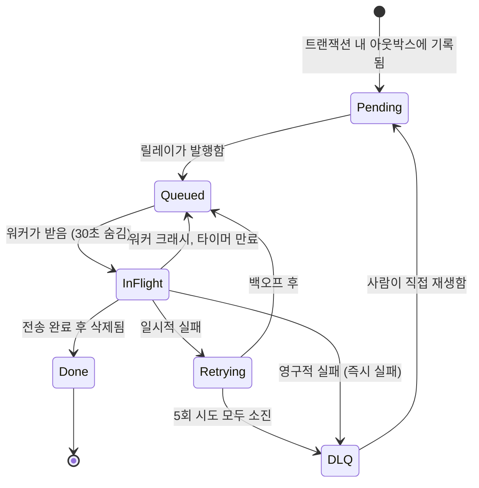
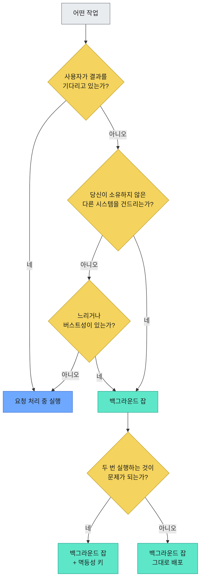

# 백그라운드 잡 실종 사건: 당신의 서비스에서 조용히 사라지는 4가지 이유와 완벽 방어 전략

안녕하세요! 10년 차 IT 실무자이자 테크 블로거, 현업 개발자입니다. 오늘은 백엔드 개발자들이라면 누구나 한 번쯤 겪어봤을, 혹은 겪게 될 '백그라운드 잡 실종 사건'에 대해 이야기해볼까 합니다.

사용자가 앱에 가입합니다. 이메일과 비밀번호를 입력하고 '제출' 버튼을 누르면, 거의 즉시 서비스 안으로 들어갈 것이라고 기대하죠. 그 흐름 어딘가에, 환영 이메일이 발송되어야 합니다.

"그리고 환영 이메일도 보내야 해"라는 이 한 문장은, 백엔드 엔지니어링에서 가장 큰 '기둥 같은 거짓말' 중 하나입니다. 언뜻 보면 주석처럼 가볍게 느껴지지만, 사실은 거대한 서브시스템이죠. 만약 이 부분을 가장 '뻔한' 방식으로 구현한다면, 여러분은 꽤나 고통스러운 경험을 하게 될 겁니다.

그러니 오늘은 그 '뻔한' 방식부터 시작해서, 더 이상 문제가 발생하지 않을 때까지 하나씩 부숴가며 해결책을 찾아보겠습니다.

---

## 💡 첫 번째 함정: 일단 이메일부터 보내기

가장 순진한 버전은 그 단순함이 아름답습니다. 하나의 함수 안에서 모든 일이 위에서 아래로 흐릅니다.

```python
@app.post("/signup")
def signup(payload):
    user = db.insert_user(payload)          # 8ms
    email.send_welcome(user.email)          # 40ms? 2s? 영원히?
    return {"ok": True, "user_id": user.id} # 드디어!
```

여기서 가운데 줄을 다시 한번 보세요. 바로 여러분의 서비스 가용성이 무덤으로 가는 길목입니다.


여러분의 로컬 개발 환경에서는 완벽하게 동작할 겁니다. 로컬 환경은 레이트 리밋(Rate Limit) 같은 걸 만나본 적이 없으니까요. 하지만 프로덕션 환경에서 `email.send_welcome` 호출은 여러분이 통제할 수 없는 외부 이메일 제공사와의 네트워크 왕복 요청이고, 그들에게 '운 나쁜 날'이라면 얘기가 달라집니다.

이로 인해 세 가지 문제가 발생합니다.

*   **느려집니다:** 여러분의 회원가입 응답 시간은 이제 이메일 제공사의 가장 느린 응답 시간(p99)에 종속됩니다. 사실상 여러분 서비스의 p99 지표를 남의 온콜 담당자에게 맡기는 꼴이죠.
*   **실패합니다:** 이메일 제공사에서 500 에러를 반환하면, 여러분의 핸들러도 예외를 발생시키고 전체 요청이 실패합니다. 사용자는 "뭔가 잘못됐어요"라는 메시지를 보게 되는데, 트랜잭션 경계가 어디에 있느냐에 따라 계정 생성이 되었는지 안 되었는지도 불확실한 상태가 됩니다.
*   **가용성이 종속됩니다:** 직렬 요청 경로에 추가되는 모든 의존성은 시스템의 실패 확률을 높입니다. 99.9% 가용성을 가진 두 서비스가 직렬로 연결되면 전체 가용성은 99.8%가 됩니다. 단순히 메일 제공사를 '사용'하는 것이 아니라, 그들의 가용성을 '상속'받는 겁니다.


이 문제의 근본 원인은 기술적인 것이 아니라 개념적인 겁니다. 계정 생성과 이메일 발송은 전혀 다른 작업이며, 각각의 긴급성 프로파일도 완전히 다릅니다. 사용자는 계정 생성이 끝나기를 기다리지만, 소프트웨어 역사상 그 누구도 환영 이메일이 도착하기를 앉아서 기다린 적은 없습니다. 그런데도 우리는 이 두 작업을 억지로 묶어 버린 거죠.

제가 실무에서 이 부분을 테스트해 봤을 때, 초기에는 단순히 `try-except`로 묶는 경우가 많았는데, 결국 실패한 이메일 발송은 재시도되지 않아 문제가 됐던 경험이 있습니다. 결국 '보낸 줄 알았는데 안 보낸' 상태가 되는 거죠.

---

## 💡 두 번째 함정: 큐에 작업을 넣었지만...

해결책은 요청 처리 중에 이메일 발송과 같은 '부수적인' 작업을 하지 않는 것입니다. 사용자를 저장하고 즉시 응답을 보낸 다음, "이메일을 보내야 합니다"라는 메모를 어딘가에 남깁니다. 별도의 워커 풀이 이 메모들을 읽고, 메일 제공사가 허용하는 속도로 실제 이메일을 발송합니다.

이 '메모 보관함'이 바로 큐(Queue)입니다. AWS SQS, RabbitMQ, Redis 위에 적절한 라이브러리를 얹은 방식 등 어떤 것이든 좋습니다.


응답 시간은 이제 "메일 API가 오늘 기분 내키는 대로"에서 약 40ms 정도로 단축됩니다. 만약 메일 제공사가 한 시간 동안 다운되더라도, 작업들은 큐에 쌓였다가 복구되면 처리됩니다. 회원가입하는 사용자는 전혀 눈치채지 못하죠.

이것은 정말 엄청난 발전입니다. 대부분의 튜토리얼이 여기서 멈추기도 합니다. 하지만 진짜 흥미로운 버그는 바로 여기에 숨어 있습니다.

다이어그램의 아래쪽 절반을 보세요.

이제 여러분의 핸들러는 **두 개의 다른 시스템에 두 번의 쓰기 작업**을 수행합니다. 사용자를 PostgreSQL에 삽입하고, 메시지를 SQS에 발행합니다. 이 두 작업을 묶는 단일 트랜잭션은 존재하지 않습니다. 애초에 서로 다른 벤더가 소유한 다른 데이터베이스들이니까요.

그렇다면 이 두 작업 사이에 프로세스가 죽으면 어떻게 될까요?

계정은 존재하지만, 이메일 발송 잡은 사라집니다. 그 사용자는 이제 영원히 환영 이메일을 받지 못하게 됩니다. 어디에도 에러는 없고, 알림도 없으며, 실패한 요청도 없습니다. 모든 시스템의 관점에서 볼 때, 모든 것이 잘 처리된 것으로 보입니다.

이것이 바로 **이중 쓰기 문제(Dual Write Problem)**이며, 크래시보다 더 악랄한 건, 바로 침묵한다는 점입니다. 순서를 뒤집으면 반대 문제가 발생합니다. 존재하지 않는 사용자에게 이메일을 보내는 잡이 생기는 거죠. 제가 이중 쓰기 문제로 인해 꽤나 골머리를 앓았던 프로젝트가 있었는데, 특정 데이터만 누락되는 바람에 서비스 관리자들이 수동으로 데이터를 복구해야 했던 아찔한 기억이 떠오르네요.

---

## 💡 두 번째 함정의 해법: 트랜잭셔널 아웃박스(Transactional Outbox)

해결책은 이름이 무시무시해 보이지만, 실제로는 생각보다 간단합니다. 바로 **트랜잭셔널 아웃박스(Transactional Outbox)** 패턴입니다.

핸들러에서 직접 큐에 쓰지 마세요. 대신, 데이터베이스의 테이블에 씁니다. 사용자 레코드를 삽입하는 것과 동일한 데이터베이스에서, 동일한 트랜잭션 안에서요.

```sql
BEGIN;
  INSERT INTO users (id, email)          VALUES ('u_881', 'ada@example.com');
  INSERT INTO outbox (id, type, payload) VALUES ('j_204', 'send_welcome', '{"user_id":"u_881"}');
COMMIT;
```

이제는 정확히 하나의 시스템에, 정확히 한 번의 쓰기 작업만 존재하며, 정확히 하나의 커밋에 의해 보호됩니다. 사용자도, 잡도 둘 다 존재하거나, 둘 다 존재하지 않습니다. 프로세스가 크래시될 틈이 사라졌기 때문에 균열은 더 이상 없습니다.


별도의 릴레이(Relay) 프로세스가 전송되지 않은 아웃박스 레코드를 읽어 실제 큐에 발행합니다. 이는 테이블을 주기적으로 폴링하거나, Debezium 같은 도구를 이용해 WAL(Write Ahead Log)을 테일링하는 방식으로 구현할 수 있습니다.

여기서 사람들이 종종 간과하는 부분이 있는데, 솔직하게 말씀드리겠습니다.

**아웃박스는 '정확히 한 번(exactly-once)' 전송을 보장하지 않습니다.** 릴레이는 메시지를 발행한 후, 해당 레코드를 '전송됨'으로 표시하기 전에 크래시될 수 있습니다. 재시작 시, 동일한 잡을 다시 발행하게 될 겁니다. 이는 "조용히 잡을 잃는" 실패에서 "가끔 잡을 두 번 실행하는" 실패로 바꾼 것인데, 이는 엄청난 이득입니다. 왜냐하면 후자는 고칠 수 있지만, 전자는 눈에 보이지 않기 때문이죠.

이 부분은 잠시 마음속에 담아두세요. 10 문단 뒤에 다시 등장합니다. 제가 실제 프로젝트에서 아웃박스 패턴을 적용했을 때, 초기에는 릴레이 프로세스의 장애 복구 시나리오를 제대로 고려하지 않아 중복 메시지 발행이 발생하곤 했습니다. 결국 '결과적 일관성'과 '최소 한 번'이라는 개념을 이해하고 설계하는 것이 중요하다고 깨달았죠.

---

## 💡 세 번째 함정: 끝나지 않은 잡을 삭제해 버리기

파이프라인의 더 아래쪽에서 새로운 유형의 실패가 발생합니다.

워커가 큐에서 잡을 꺼내 이메일 발송을 시작합니다. 그런데 중간에 파드가 강제 종료되거나, 배포가 롤백되거나, 스팟 인스턴스가 회수됩니다. 워커가 사라진 거죠.

그 잡은 어디로 갔을까요?

만약 큐가 메시지를 워커에게 넘겨주는 순간 삭제해 버린다면, 그 잡은 어디에도 없을 겁니다. 이미 '소비'되었으니까요. 큐에도 없고, 완료되지도 않았고, 아무도 그 잡을 찾으려 하지 않을 겁니다.


실제 큐는 그렇게 동작하지 않습니다. 이들은 **가시성 타임아웃(Visibility Timeout)**이라는 메커니즘을 사용합니다.

워커가 잡을 받으면, 그 잡은 **삭제되지 않고 숨겨집니다.** 특정 시간(예: 30초) 동안 보이지 않는 상태로 유지됩니다. 이때 두 가지 일이 일어날 수 있습니다.

*   워커가 작업을 완료하고 메시지를 명시적으로 삭제합니다. 잡은 완료되었고, 완전히 사라집니다.
*   워커가 완료하지 못하고 죽습니다. 타이머가 만료되면, 잡은 다시 보이게 되고, 다음 폴링하는 워커가 그 잡을 가져갑니다.

아무것도 잃지 않습니다. 삭제는 '영수증'이지 '인출'이 아닙니다.

한 가지 실용적인 팁: 가시성 타임아웃은 가장 느리게 처리될 수 있는 현실적인 작업 시간보다 길게 설정해야 합니다. 그렇지 않으면 45초 걸리는 잡이 30초 만에 재전달되어 두 워커가 동시에 작업을 처리하는 웃픈 상황이 발생할 수 있습니다. 각자 자신만이 작업한다고 착각하면서요.

### 대가 지불: 최소 한 번(At-Least-Once)

여러분은 방금 무엇을 보장했는지 보세요. 잡은 절대 사라지지 않습니다. 이는 "잡이 정확히 한 번 실행된다"는 약속보다 엄격히 약한 보장이며, 큐는 그 이상을 가장하지도 않습니다.

워커가 이메일을 보냅니다. 삭제 호출 직전 마이크로초에 워커가 크래시됩니다. 타이머가 만료됩니다. 두 번째 워커가 이메일을 다시 보냅니다.


사용할 가치가 있는 모든 분산 큐는 '최소 한 번(at-least-once)'을 보장합니다. 네트워크를 통한 '정확히 한 번(exactly-once)' 전달은 돈 주고 살 수 있는 것이 아니기 때문입니다. '최소 한 번' 전달 위에 '정확히 한 번'의 *효과*를 구축할 수 있을 뿐이며, 이는 큐가 아니라 워커에서 처리해야 합니다.

즉, 여러분의 워커는 **멱등성(Idempotent)**을 가져야 합니다.

잡 생성 시점에 아웃박스 레코드에 고유한 ID를 부여하세요. 워커는 작업이 완료되면 그 ID를 기록하고, 작업을 시작하기 전에 그 ID를 확인합니다.

```python
def handle(job):
    # 고유 인덱스가 우리 대신 논쟁을 끝내준다
    inserted = db.execute(
        "INSERT INTO processed_jobs (job_id) VALUES (%s) ON CONFLICT DO NOTHING",
        job.id,
    )
    if inserted.rowcount == 0:
        return  # 누군가 이미 이 작업을 처리했으니, 그냥 돌아가.

    email.send_welcome(job.payload["user_id"])
```

여기서 실질적인 작업을 수행하는 것은 고유 제약조건(Unique Constraint)입니다. 이 문제에 대한 올바른 수준의 영리함이죠. 두 워커가 동시에 경합하더라도 데이터베이스가 승자를 가려냅니다. 그게 데이터베이스가 하는 일이니까요.

사람들이 흔히 실수하는 두 가지가 있습니다.

*   **마커를 기록하는 위치가 중요합니다.** 만약 마커가 사이드 이펙트와 다른 저장소에 있다면, 여러분은 한 계층 아래에서 이중 쓰기 문제를 다시 만들어낸 겁니다. 결국 똑같은 문제의 반복이죠.
*   **모든 잡에 이 메커니즘이 필요한 것은 아닙니다.** `SET last_login = now()`와 같은 작업은 본질적으로 멱등합니다. 두 번 실행해도 아무것도 달라지지 않죠. 하지만 `INCREMENT credits BY 10`은 절대 그렇지 않습니다. 어떤 작업이 어떤 유형인지 파악해야 합니다. 불필요한 멱등성 구현은 그저 지연 시간만 늘릴 뿐입니다.

제가 실제 프로젝트에서 포인트 지급 시스템을 만들 때 `INCREMENT` 연산 때문에 중복 지급 사고가 날 뻔한 적이 있습니다. 그때 멱등성 처리를 하지 않았다면 아마 심각한 문제로 이어졌을 겁니다. 모든 작업에 이 복잡한 로직을 적용하기보다는, 작업의 특성을 파악하고 필요한 곳에만 적용하는 지혜가 필요합니다.

---

## 💡 네 번째 함정: 영원히 작동하지 않을 잡들

어떤 잡은 불운한 것이 아닙니다. 처음부터 운명이 정해진 겁니다.

이메일 주소가 `bob@@gmial.con`일 수 있습니다. 계정이 삭제되었을 수도 있고요. 페이로드가 더 이상 존재하지 않는 레코드를 참조할 수도 있습니다. 이런 잡은 우주의 열사병에 걸릴 때까지 30초마다 재시도하더라도 매번 실패할 것이며, 쿼터를 낭비하고 로그를 가득 채울 겁니다.


따라서 두 가지 종류의 실패에 대해 서로 다른 동작이 필요합니다.

*   **일시적인 실패(Transient failures)**는 지수 백오프(exponential backoff)와 지터(jitter)를 사용하여 재시도합니다. 429 에러, 타임아웃, 503 에러 등이 여기에 해당하죠. 제공사가 잠시 문제를 겪고 있는 것이고, 곧 괜찮아질 겁니다. 여러분이 문제의 원인 중 일부가 되지 않도록 백오프하고, 수천 개의 큐에 쌓인 잡이 동시에 재시도되어 다시 시스템을 다운시키지 않도록 지터를 추가합니다. AWS에서 이에 대한 모범 사례를 잘 정리해 두었습니다.
*   **영구적인 실패(Permanent failures)**는 전혀 재시도해서는 안 됩니다. `bob@@gmial.con` 같은 잘못된 형식의 주소가 네 번째 시도에서 갑자기 올바른 형식으로 바뀌지는 않을 겁니다. 그리고 일반적으로 5회 정도의 제한된 재시도 횟수 이후에는 잡이 중단되어야 합니다.


영원히 재시도되거나 조용히 사라지는 것이 아니라, **데드 레터 큐(Dead Letter Queue, DLQ)**로 보내집니다.

DLQ는 무덤이 아니라 '주차장'입니다. 잡은 페이로드와 실패 이력을 그대로 보존한 채 그곳에 머물러서, 사람이 직접 내용을 보고 무엇이 잘못되었는지 파악하고, 원인을 수정한 다음, 다시 재생할 수 있도록 합니다.

중요한 부분이니 큰 소리로 다시 한번 강조하겠습니다. 많은 팀이 이 부분을 잘못 이해하고 있는 것을 지켜봤습니다. **어떤 사람에게도 알림이 가지 않는 데드 레터 큐는 데이터를 더 느리고 더 비싸게 잃는 방법일 뿐입니다.** DLQ 깊이가 0보다 커지면 알람이 울리도록 설정하세요. 만약 아무런 알림도 오지 않는다면, 시스템이 완벽하거나 알람이 고장 난 둘 중 하나일 테고, 저는 후자에 걸겠습니다. 운영팀에 있었을 때, DLQ 알람이 없어 중요한 작업 실패를 뒤늦게 발견하고 밤샘 복구를 했던 끔찍한 기억이 있습니다. DLQ 알람은 선택이 아닌 필수입니다.

다음은 전체 라이프사이클을 하나의 그림으로 나타낸 것입니다.



`InFlight` 상태에 세 가지 종료 경로가 있고, 그중 단 하나만이 성공이라는 점을 주목하세요. 이 비율 자체가 백그라운드 시스템의 존재 이유입니다.

---

## 모든 것을 조합하다

네 가지 버전을 거쳐, 우리가 실제로 배포해야 할 것은 다음과 같은 모습입니다.


그리고 어떤 작업이 어디에 속하는지 고민할 때 사용할 의사결정 경로입니다.



---

## 그래서 무엇을 얻었나?

잠시 복잡한 박스들을 뒤로하고 생각해 봅시다. 이 파이프라인을 보면 단 하나의 이메일을 보내기 위해 엄청난 시스템을 구축했다고 결론 내리기 쉽습니다.

하지만 그렇지 않습니다. 우리는 네 가지 핵심적인 특성을 얻었으며, 이 각각은 문제가 발생했던 이전 버전들에 대한 직접적인 해답입니다.

*   **응답이 절대 외부 시스템에 종속되지 않습니다.** (버전 1 문제 해결)
*   **작업과 계정이 함께 커밋되거나, 아니면 둘 다 커밋되지 않습니다.** (버전 2 문제 해결)
*   **크래시된 워커는 아무것도 잃지 않으며, 단순히 작업을 반복할 뿐이고, 멱등성이 반복을 처리합니다.** (버전 3 문제 해결)
*   **결코 성공할 수 없는 작업은 사람이 확인할 수 있는 곳으로 보내집니다.** (버전 4 문제 해결)


이 모든 것이 이메일 전달의 신뢰성을 높이지는 않습니다. 이메일은 원래 신뢰할 수 없는 매체입니다. 하지만 이 시스템은 **여러분의 회원가입 프로세스**를 이메일로부터 독립적으로 만들며, 이는 여러분이 통제할 수 있는 유일한 부분입니다.

이 일반적인 교훈은 예시를 넘어섭니다. 요청 핸들러에서 "그리고 또(and also)"라는 말을 쓰는 자신을 발견할 때마다, 즉 "그리고 또 이메일을 보내고, 그리고 또 검색 인덱스를 업데이트하고, 그리고 또 CRM에 핑을 보내는" 모든 순간에, 여러분은 백그라운드 잡을 만들고 있는 겁니다. 바로 그 "그리고 또"가 신호입니다.

이런 작업은 요청 처리 흐름 밖으로 밀어내고, 트랜잭션 방식으로 기록하며, 반복 가능하게 만들고, 실패하더라도 크게 알릴 수 있는 장소를 마련해 주세요.

---

_팀의 집중력은 한정되어 있고, AI 생성 코드의 홍수 속에서 프로덕션 코드를 안전하게 유지하는 것은 속도를 늦추지 않으면서 더 어려워지고 있습니다._

_저는 현재 **LiveReview**를 개발하고 있습니다. 비즈니스 핵심 시스템을 위해 구축된, 영향 범위(Blast Radius)를 인지하는 AI 코드 리뷰 솔루션입니다._

_LiveReview는 모든 Diff를 동일하게 강조하는 대신, **각 변경 사항의 영향 범위를 콜 그래프를 통해 점수화하여 실제 중요한 부분에 집중할 수 있도록 돕습니다.**_

_비즈니스 위험이 가장 높은 곳에 코드 리뷰 노력을 집중하고, 모든 Diff에 균등하게 분산하지 마세요._

_**여러분의 코드베이스에서 LiveReview를 사용해 보세요:**_

<a href="https://hexmos.com/livereview"></a>

---
원문: [https://dev.to/lovestaco/your-welcome-email-is-not-part-of-signup-designing-a-background-job-system-1lmo](https://dev.to/lovestaco/your-welcome-email-is-not-part-of-signup-designing-a-background-job-system-1lmo)
수집일: 2026-09-04 01:38:03
