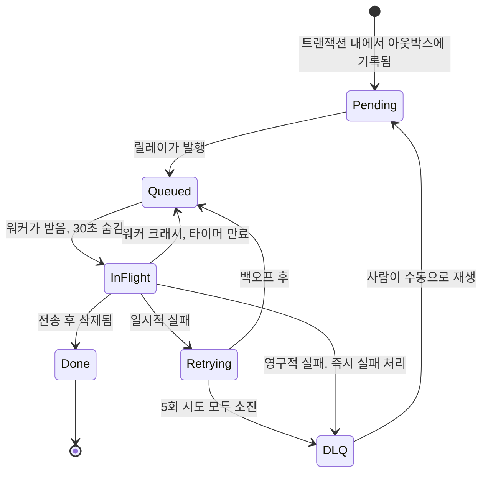
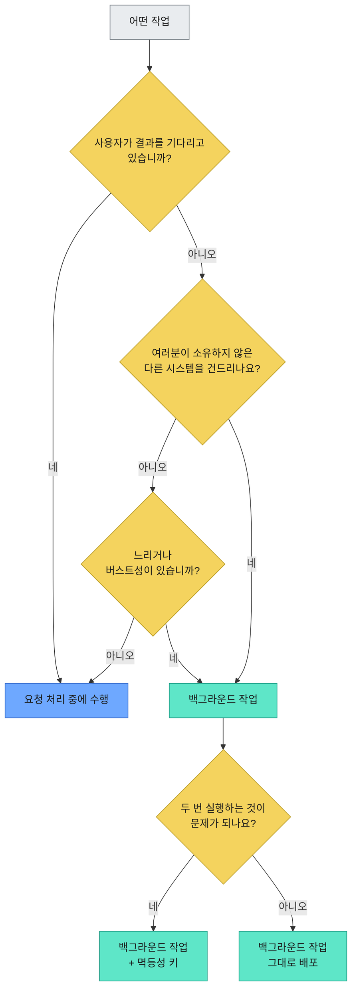

# 어느 날 사라지는 백그라운드 작업, 10년차 개발자가 찾아낸 4가지 원인과 완벽 방어 전략

서비스에 가입하는 사용자를 떠올려 봅시다. 이메일과 비밀번호를 입력하고 '제출' 버튼을 누르면, 거의 즉시 서비스에 로그인되기를 기대하죠. 그 과정 어딘가에서는 사용자에게 환영 이메일이 발송되어야 합니다.

"그리고 환영 이메일도 보내야 해"라는 이 한 문장은 백엔드 엔지니어링의 가장 거대한 '하중 지지 거짓말(load-bearing lies)' 중 하나입니다. 마치 각주처럼 들리지만, 사실 이 작업은 완전한 서브시스템입니다. 만약 이를 가장 '뻔한' 방식으로 구현한다면, 그 대가를 톡톡히 치르게 될 겁니다.

그러니 일단 그 뻔한 방법부터 시작해서, 더 이상 문제가 생기지 않을 때까지 계속해서 개선해 나가는 과정을 살펴보죠.

## 버전 1: 그냥 이메일을 보낸다

가장 단순하고 순진한 버전은 그 간결함이 아름답기까지 합니다. 하나의 함수가 위에서 아래로 모든 작업을 처리합니다.

```python
@app.post("/signup")
def signup(payload):
    user = db.insert_user(payload)          # 8ms
    email.send_welcome(user.email)          # 40ms? 2s? forever?
    return {"ok": True, "user_id": user.id} # finally
```

여기서 두 번째 줄을 다시 한번 읽어보세요. 바로 그곳에서 여러분 서비스의 가용성(uptime)이 죽음의 길로 접어듭니다.


여러분의 로컬 개발 환경에서는 이 코드가 완벽하게 작동할 겁니다. 로컬 PC는 레이트 리밋(rate limit)이라는 것을 만나본 적이 없으니까요. 하지만 프로덕션 환경에서 `email.send_welcome` 호출은 여러분이 통제할 수 없는 외부 메일 서비스에 대한 네트워크 왕복 통신이며, 최악의 경우 그 서비스에 문제가 생긴 날에는 더 큰 재앙이 됩니다.

다음 세 가지 문제가 발생합니다.

*   **느려집니다.** 여러분의 회원가입 프로세스는 이제 메일 제공 업체의 가장 느린 응답 시간(p99)에 종속됩니다. 다른 회사의 온콜(on-call) 담당자에게 여러분 서비스의 p99 지표를 넘겨준 셈입니다.
*   **실패합니다.** 메일 제공 업체가 500 에러를 반환하면, 여러분의 핸들러는 예외를 발생시키고 전체 요청이 실패합니다. 사용자에게는 "문제가 발생했습니다"라는 메시지가 보이지만, 트랜잭션 경계가 어디에 설정되어 있는지에 따라 계정은 이미 생성되었을 수도, 아닐 수도 있습니다.
*   **다른 서비스에 가용성을 의존하게 됩니다.** 직렬 요청 경로에 추가되는 모든 의존성은 시스템의 실패 확률을 곱합니다. 99.9% 가용성을 가진 두 서비스가 직렬로 연결되면 전체 가용성은 99.8%가 됩니다. 메일 제공 업체를 '사용하는' 것이 아니라, 그들의 가용성을 '상속받는' 것이죠.


이 문제의 근본 원인은 기술적이라기보다는 개념적입니다. 계정 생성과 이메일 발송은 성격이 완전히 다른 두 가지 작업이며, 긴급성 또한 다릅니다. 사용자는 첫 번째(계정 생성)를 기다리지만, 소프트웨어 역사상 그 누구도 환영 이메일을 기다리며 앉아있던 적은 없습니다. 그런데 우리는 이 두 가지를 아무 생각 없이 한데 묶어버린 거죠. 제가 실무에서 이 부분을 테스트해 봤을 때, 메일 발송 API의 응답 지연 때문에 웹 서비스의 응답 시간도 함께 길어지는 걸 보면서 '이건 아니다' 싶었던 기억이 생생합니다.

## 버전 2: 작업을 큐에 넣는다

해결책은 요청 처리 중에 두 번째 작업을 하지 않는 것입니다. 사용자를 저장하고 즉시 응답을 반환한 다음, "이메일을 보내야 합니다"라는 메모를 어딘가에 남깁니다. 별도의 워커 풀이 이 메모들을 읽고 메일 제공 업체가 허용하는 속도에 맞춰 실제 발송 작업을 처리합니다.

이 '메모 보관함'이 바로 큐(Queue)입니다. AWS SQS, RabbitMQ, 적절한 라이브러리가 얹어진 Redis 등 여러분이 선호하는 어떤 것이든 좋습니다.


이제 응답 시간은 "메일 API가 오늘 기분에 따라 걸리는 시간"에서 약 40ms 정도로 급감합니다. 만약 메일 제공 업체가 한 시간 동안 다운되더라도, 작업들은 큐에 쌓였다가 복구되면 다시 처리됩니다. 가입하는 사용자들은 아무것도 눈치채지 못하죠.

이것은 정말 엄청난 발전입니다. 대부분의 튜토리얼이 여기서 멈추는 지점이기도 하지만, 진짜 흥미로운 버그가 숨어있는 곳이기도 합니다. 위 다이어그램의 하단 절반을 보세요.

여러분 핸들러는 이제 **두 개의 다른 시스템에 두 번의 쓰기 작업**을 수행합니다. 사용자를 Postgres에 삽입하고, SQS에 메시지를 발행합니다. 이 둘을 아우르는 단일 트랜잭션은 존재할 수 없습니다. 서로 다른 벤더가 소유한, 서로를 모르는 별개의 데이터베이스들이기 때문이죠.

그럼 만약 이 두 작업 사이에 프로세스가 죽으면 어떻게 될까요?

계정은 존재하지만, 이메일 발송 작업은 사라집니다. 그 사용자는 이제 영원히 환영 이메일을 받지 못하게 되고, 어디에도 오류나 알림, 실패한 요청 기록조차 없습니다. 모든 시스템의 관점에서 보면, 모든 것이 잘 처리된 것처럼 보입니다.

이것이 바로 [이중 쓰기 문제(dual write problem)](https://www.confluent.io/blog/transactional-outbox-pattern-real-time-data-processing/)이며, 크래시보다 더 고약한 것은 소리 없이 발생한다는 점입니다. 순서를 반대로 하면, 존재하지 않는 사용자에게 이메일을 보내려는 작업이 생기는 거울 이미지를 얻게 됩니다. 실제로 저도 이런 이중 쓰기 문제로 인해 사용자에게 환영 이메일이 발송되지 않아 고객 지원팀에 문의가 빗발쳤던 경험이 있습니다. 그때의 뼈아픈 경험이 저를 트랜잭셔널 아웃박스로 이끌었죠.

## 버전 2.5: 트랜잭셔널 아웃박스

해결책에는 이름이 붙어 있는데, 실제보다 훨씬 위협적으로 들립니다. 바로 [트랜잭셔널 아웃박스(transactional outbox)](https://microservices.io/patterns/data/transactional-outbox.html) 패턴입니다.

핸들러에서 큐로 바로 쓰는 것을 멈추세요. 대신, 하나의 테이블에 기록합니다. 사용자 데이터베이스와 동일한 데이터베이스의 동일한 트랜잭션 내에서 말이죠.

```sql
BEGIN;
  INSERT INTO users (id, email)          VALUES ('u_881', 'ada@example.com');
  INSERT INTO outbox (id, type, payload) VALUES ('j_204', 'send_welcome', '{"user_id":"u_881"}');
COMMIT;
```

이제 하나의 시스템에 정확히 하나의 쓰기 작업이, 정확히 하나의 커밋에 의해 보호됩니다. 사용자 데이터와 작업 모두 존재하거나, 둘 다 존재하지 않거나 둘 중 하나입니다. 프로세스가 크래시할 틈이 없어졌으므로, '균열(crack)'은 사라집니다.


별도의 릴레이(relay) 프로세스가 전송되지 않은 아웃박스(outbox) 테이블의 레코드를 읽어 실제 큐에 발행합니다. 이는 테이블을 주기적으로 폴링하거나, [Debezium](https://debezium.io/documentation/reference/stable/transformations/outbox-event-router.html) 같은 도구를 이용해 WAL(Write Ahead Log)을 테일링하는 방식으로 구현할 수 있습니다.

여기서 사람들이 종종 간과하는 부분이 있는데, 솔직하게 이야기해 볼게요.

**아웃박스는 '정확히 한 번(exactly-once)'을 보장하지 않습니다.** 릴레이 프로세스가 메시지를 발행한 후, 해당 레코드를 '전송됨'으로 표시하기 전에 크래시가 발생할 수 있습니다. 재시작 시, 동일한 작업을 다시 발행하게 되죠. 이것은 실패 모드를 "작업을 소리 없이 잃는 것"에서 "가끔 작업을 두 번 수행하는 것"으로 바꾼 것인데, 이는 놀라운 트레이드오프입니다. 왜냐하면 후자는 고칠 수 있지만, 전자는 보이지 않는 문제니까요.

이 생각을 잠시 붙잡아 두세요. 열 문단 뒤에 다시 등장할 겁니다.

## 버전 3: 끝나지 않은 작업을 삭제하지 마세요

파이프라인의 더 아래 단계에서 새로운 실패 유형이 발생합니다.

워커가 큐에서 작업을 꺼내어 메일을 보내기 시작합니다. 중간에, 워커가 실행되던 파드(pod)가 축출되거나, 배포(deploy)가 롤백되거나, 스팟 인스턴스(spot instance)가 회수됩니다. 워커는 사라집니다.

그럼 작업은 어디로 갔을까요?

만약 큐가 메시지를 꺼내자마자 삭제한다면, 답은 '어디에도 없다'입니다. 이미 소비되었으니 큐에도 없고, 완료되지도 않았으며, 아무도 그 작업을 찾으려 하지 않을 겁니다.


실제 큐는 그렇게 작동하지 않습니다. 이들은 [가시성 타임아웃(visibility timeout)](https://docs.aws.amazon.com/AWSSimpleQueueService/latest/SQSDeveloperGuide/sqs-visibility-timeout.html)이라는 메커니즘을 사용합니다.

워커가 작업을 받으면, 그 작업은 **삭제되지 않고 숨겨집니다.** 예를 들어 30초 동안 보이지 않는 상태로 유지됩니다. 여기서 두 가지 상황이 발생할 수 있습니다.

*   워커가 작업을 완료하고 명시적으로 메시지를 삭제합니다. 작업은 완료되고 완전히 사라집니다.
*   워커가 작업을 완료하지 못하고 죽습니다. 타이머가 만료되면 작업은 다시 보이게 되고, 큐를 폴링하는 다음 워커가 그 작업을 가져갑니다.

아무것도 잃지 않습니다. 삭제는 '영수증'이지 '인출'이 아닙니다.

한 가지 실용적인 팁: 가시성 타임아웃은 여러분의 가장 느린 작업보다 길게 설정하세요. 그렇지 않으면 45초 걸리는 작업이 30초에 다시 배달되어 두 워커가 동시에 작업을 수행하는 흥미로운 시나리오를 겪게 될 수 있습니다. 둘 다 자신이 혼자 작업하고 있다고 착각하면서 말이죠.

### 대가: 최소 한 번(at-least-once) 보장

이제 여러분이 보장한 것이 무엇인지 보세요. 작업은 절대 사라지지 않습니다. 이 약속은 "작업이 정확히 한 번 실행된다"는 약속보다 엄격하게 약하며, 큐는 애초에 정확히 한 번을 약속하지도 않습니다.

워커가 이메일을 보냅니다. 삭제 호출 직전 마이크로초 단위로 워커가 크래시합니다. 타이머가 만료됩니다. 두 번째 워커가 이메일을 다시 보냅니다.


사용할 가치가 있는 모든 분산 큐는 '최소 한 번'을 보장합니다. 네트워크를 통한 '정확히 한 번' 전달은 애초에 [구매할 수 있는 것이 아니기 때문](https://www.confluent.io/blog/exactly-once-semantics-are-possible-heres-how-apache-kafka-does-it/)이죠. '최소 한 번' 전달 위에 '정확히 한 번' *효과*를 구축할 수 있을 뿐이며, 이 작업은 큐가 아닌 워커에서 수행됩니다.

이는 곧 여러분의 워커가 멱등성(idempotent)을 가져야 한다는 것을 의미합니다.

생성 시점에 각 작업에 안정적인 ID를 부여하고, 이를 아웃박스 테이블에 기록합니다. 워커는 작업이 완료될 때 그 ID를 기록하고, 작업을 시작하기 전에 이를 확인합니다.

```python
def handle(job):
    # 유니크 인덱스가 우리 대신 논쟁을 끝내줍니다.
    inserted = db.execute(
        "INSERT INTO processed_jobs (job_id) VALUES (%s) ON CONFLICT DO NOTHING",
        job.id,
    )
    if inserted.rowcount == 0:
        return  # 이미 누군가 이 작업을 완료했습니다. 돌아가세요.

    email.send_welcome(job.payload["user_id"])
```

여기서 유니크 제약 조건이 실제 작업을 수행하며, 이 문제에 필요한 만큼의 현명한 접근 방식입니다. 두 워커가 동시에 작업을 시도하더라도, 데이터베이스가 승자를 가려냅니다. 그게 바로 데이터베이스의 역할이니까요.

사람들이 흔히 실수하는 두 가지가 있습니다.

*   **마커를 기록하는 위치가 중요합니다.** 마커가 사이드 이펙트(side effect)와 다른 저장소에 있다면, 여러분은 단지 이중 쓰기 문제를 한 단계 아래에서 재현한 것에 불과합니다. (거북이는 항상 아래에 있습니다.)
*   **모든 작업에 이 복잡한 메커니즘이 필요한 것은 아닙니다.** `SET last_login = now()`와 같은 작업은 본질적으로 멱등성을 가집니다. 두 번 실행해도 아무것도 변하지 않죠. `INCREMENT credits BY 10`은 전혀 그렇지 않습니다. 어떤 작업이 어떤 유형인지 파악하세요. 필요 없는 멱등성 로직은 그저 불필요한 지연(latency)을 추가할 뿐입니다.

## 버전 4: 절대 성공하지 못할 작업들

어떤 작업은 단순히 운이 없는 것이 아닙니다. 그것들은 태생적으로 실패할 운명입니다.

이메일 주소가 `bob@@gmial.con`이라든지, 계정이 이미 삭제되었다든지, 페이로드가 더 이상 존재하지 않는 레코드를 참조한다든지 하는 경우입니다. 그런 작업은 30초마다 재시도해도 우주의 열죽음이 올 때까지 매번 실패할 것이며, 쿼터를 소모하고 로그를 가득 채울 뿐입니다.


따라서 두 가지 유형의 실패에 대해 두 가지 다른 동작이 필요합니다.

*   **일시적 실패(Transient failures)**는 지수 백오프(exponential backoff)와 지터(jitter)를 적용하여 재시도해야 합니다. 429 에러, 타임아웃, 503 에러 등이 여기에 해당하죠. 메일 제공 업체가 잠시 문제가 생겼지만 곧 정상으로 돌아올 겁니다. 백오프를 통해 여러분이 문제의 원인 중 하나가 되는 것을 피하고, 지터를 통해 만 개의 큐 작업이 동시에 재시도하여 시스템을 다시 다운시키는 것을 방지합니다. [AWS에서 이 부분에 대한 정석적인 글을 작성했습니다](https://aws.amazon.com/builders-library/timeouts-retries-and-backoff-with-jitter/).
*   **영구적 실패(Permanent failures)**는 아예 재시도해서는 안 됩니다. 잘못된 형식의 이메일 주소가 네 번째 시도에서 올바르게 변할 리 없습니다.

그리고 보통 다섯 번 정도의 제한된 시도 횟수를 넘어서면, 작업은 멈춥니다.


영원히 재시도하지 않으며, 절대 소리 없이 사라지지도 않습니다. 이 작업들은 [데드 레터 큐(Dead Letter Queue, DLQ)](https://docs.aws.amazon.com/AWSSimpleQueueService/latest/SQSDeveloperGuide/sqs-dead-letter-queues.html)로 이동합니다.

DLQ는 무덤이 아니라 주차장입니다. 작업들은 페이로드와 실패 기록을 온전히 유지한 채 그곳에 머무르며, 나중에 사람이 직접 확인하여 무엇이 잘못되었는지 파악하고, 원인을 수정한 후 다시 재생(replay)할 수 있도록 합니다.

가장 중요한 부분을 크게 외쳐 말하겠습니다. 왜냐하면 많은 팀이 이 부분에서 실수하는 것을 봤기 때문입니다. **누구도 알림을 받지 않는 데드 레터 큐는 그저 데이터를 더 느리고 비싸게 잃는 방법일 뿐입니다.** DLQ 깊이가 0보다 커지면 무조건 알람을 설정하세요. 만약 아무런 알람도 울리지 않는다면, 여러분 시스템이 완벽하거나 알람이 고장 난 둘 중 하나인데, 저는 후자에 걸겠습니다.

여기 전체 라이프사이클을 하나의 그림으로 나타냈습니다.



`InFlight` 상태에서 성공(Done)으로 가는 출구가 하나뿐이고, 나머지는 실패 경로라는 점에 주목하세요. 이 비율이 백그라운드 시스템의 전체 역할을 대변합니다.

## 종합 정리

네 번의 버전업 끝에, 여러분이 실제로 배포해야 할 시스템의 모습은 다음과 같습니다.


그리고 어떤 작업이 어디에 속해야 할지 고민될 때 따를 수 있는 의사결정 경로입니다.



## 이 모든 노력이 가져다준 것

잠시 상자들을 뒤로하고 이 파이프라인을 살펴보면, 이메일 하나 보내려고 엄청난 것을 만들었다고 결론 내리기 쉽습니다. 하지만 그렇지 않습니다. 여러분은 네 가지 특정 속성을 얻었고, 각각은 문제를 일으켰던 이전 버전들에 대한 직접적인 해답이 됩니다.

*   응답은 결코 서드파티 서비스의 응답을 기다리지 않습니다. 이것이 버전 1의 해결책이었죠.
*   작업과 계정 생성이 함께 커밋되거나, 둘 다 실패합니다. 버전 2의 문제를 해결했습니다.
*   크래시된 워커는 아무것도 잃지 않으며, 단지 반복될 뿐이고, 멱등성이 이 반복을 처리합니다. 버전 3의 해법입니다.
*   절대 성공할 수 없는 작업은 사람이 볼 수 있는 곳으로 이동합니다. 버전 4를 통해 얻은 결과입니다.


이 모든 노력이 이메일 전송 자체를 안정적으로 만들지는 않습니다. 이메일은 원래 안정적이지 않았고, 앞으로도 그럴 겁니다. 하지만 이것이 가능하게 한 것은 바로 **여러분의 회원가입 프로세스**를 이메일 전송과 독립적으로 만든다는 점이며, 이 문장에서 여러분이 통제할 수 있는 유일한 부분이 바로 이것입니다.

이 일반적인 교훈은 예시를 넘어섭니다. 요청 핸들러에서 "그리고 또한(and also)"이라는 말을 쓰고 있는 자신을 발견할 때마다—"그리고 또한 이메일을 보내고", "그리고 또한 검색 인덱스를 업데이트하고", "그리고 또한 CRM에 핑을 보내고"—여러분은 백그라운드 작업을 설명하고 있는 것입니다. 이 "또한"이라는 단어가 바로 핵심 신호입니다.

그 작업을 요청 처리 경로에서 분리하고, 트랜잭션 방식으로 기록하며, 반복 가능하게 만들고, 문제가 생겼을 때 크게 알릴 수 있는 방법을 마련해야 합니다.

---

_여러분의 팀의 집중력은 한정적이며, 쏟아지는 AI 생성 코드 때문에 프로덕션 코드를 안전하게 유지하면서도 속도를 늦추지 않기가 점점 더 어려워지고 있습니다._

_저는 여러분의 비즈니스 핵심 시스템을 위해 개발된, **영향 범위(blast-radius)를 인지하는 AI 코드 리뷰 도구인 LiveReview**를 만들고 있습니다._

_모든 변경 사항을 동일하게 강조하는 대신, **LiveReview는 각 변경 사항을 호출 그래프(call graph)를 통해 영향이 미치는 범위, 즉 '영향 범위'에 따라 점수를 매깁니다. 이를 통해 여러분은 실제로 중요한 곳에 집중할 수 있습니다.**_

_코드 리뷰 노력을 비즈니스 위험이 가장 높은 곳에 집중하세요—모든 변경 사항에 균등하게 분배하는 대신 말이죠._

**LiveReview를 여러분의 코드베이스에 직접 적용해보세요:**

<a href="https://hexmos.com/livereview"></a>

---
원문: [https://dev.to/lovestaco/your-welcome-email-is-not-part-of-signup-designing-a-background-job-system-1lmo](https://dev.to/lovestaco/your-welcome-email-is-not-part-of-signup-designing-a-background-job-system-1lmo)
수집일: 2026-09-05 01:38:56
