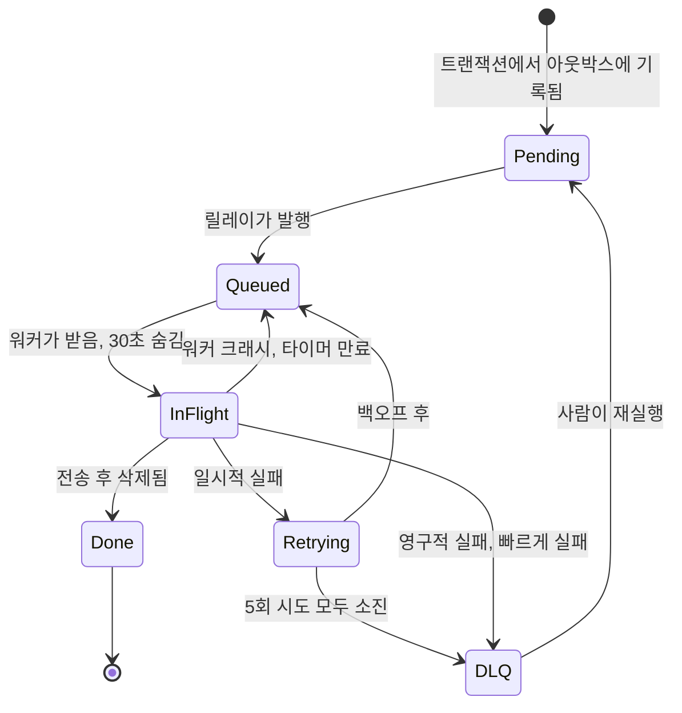

# 당신의 백그라운드 작업이 소리 없이 사라지는 4가지 이유 (10년차 실무자의 완전정복 가이드)

사용자가 앱에 가입합니다.

이메일과 비밀번호를 입력하고 '제출' 버튼을 누르면, 거의 즉시 서비스에 접속되리라 기대하죠.

그 흐름 어딘가에서, 환영 이메일이 발송되어야 합니다.

"그리고 환영 이메일도 보내야 해"라는 이 한 문장은 백엔드 엔지니어링의 위대한 '하중 지지 거짓말(load-bearing lies)' 중 하나입니다. 언뜻 보면 주석처럼 들리죠.

하지만 실제로는 완벽한 서브시스템 하나가 통째로 숨어 있으며, 만약 이 부분을 가장 *직관적인* 방식으로 구축한다면, 혹독한 대가를 치르게 될 겁니다.

그러니 우선 가장 직관적인 방법으로 시작해서, 더 이상 문제가 생기지 않을 때까지 하나씩 부숴가며 해결책을 찾아봅시다.

## 버전 1: 일단 이메일 보내기

가장 순진한 버전은 단순함이 미덕입니다. 하나의 함수 안에서 모든 작업이 위에서 아래로 실행되죠.

```python
@app.post("/signup")
def signup(payload):
    user = db.insert_user(payload)          # 8ms
    email.send_welcome(user.email)          # 40ms? 2초? 아니면 영원히?
    return {"ok": True, "user_id": user.id} # 드디어!
```

이 중간 라인을 다시 한번 잘 보세요. 여러분의 서비스 가용성이 무너져 내리는 지점입니다.


여러분의 로컬 개발 환경에서는 전혀 문제가 없을 겁니다. 랩톱은 레이트 리밋(rate limit)이라는 것을 겪어본 적이 없으니까요.

하지만 프로덕션 환경에서 `email.send_welcome` 호출은 여러분이 통제할 수 없는 외부 이메일 서비스와의 네트워크 왕복 요청입니다. 게다가 그 서비스가 운이 나쁜 날이라면 더더욱 그렇죠. 여기서 세 가지 문제가 발생합니다.

*   **느려집니다.** 여러분의 회원 가입 처리 속도는 이제 외부 메일 제공업체의 최악의 퍼센타일(p99)만큼 느려집니다. 여러분은 스스로의 p99 가용성을 남의 온콜(on-call) 담당자에게 떠넘긴 셈입니다.
*   **실패합니다.** 메일 제공업체가 500 에러를 반환하면, 여러분의 핸들러도 예외를 발생시키고 전체 요청이 실패합니다. 사용자들은 "뭔가 잘못되었습니다"라는 메시지를 보게 되는데, 트랜잭션 경계가 어디에 있었느냐에 따라 계정이 실제로 생성되었는지조차 불확실합니다.
*   **가용성이 외부 서비스에 종속됩니다.** [직렬 요청 경로에 추가되는 모든 의존성은 시스템의 실패 확률을 곱셈으로 증가시킵니다](https://landing.google.com/sre/sre-book/chapters/embracing-risk/). 99.9% 가용성을 가진 두 서비스가 직렬로 연결되면 전체 가용성은 99.8%가 됩니다. 여러분은 단순히 메일 제공업체를 '사용'하는 것이 아니라, 그들의 가용성을 '상속'받는 겁니다.


여기서 진짜 문제는 기술적인 것이 아니라 개념적인 것입니다.

계정을 생성하는 일과 이메일을 보내는 일은 본질적으로 다르고, 긴급성 프로파일도 완전히 다릅니다. 사용자는 첫 번째 작업을 기다리고 있지만, 소프트웨어 역사상 그 누구도 환영 이메일을 기다려 본 적은 없습니다.

그런데도 우리는 이 두 가지를 아무 생각 없이 한데 묶어버렸죠.

## 버전 2: 작업을 큐에 넣기

해결책은 요청 처리 중에 두 번째 작업을 수행하는 것을 멈추는 것입니다.

사용자 정보를 저장하고 즉시 응답을 보낸 다음, "이메일을 보내야 함"이라는 메모를 어딘가에 남깁니다. 별도의 워커 풀이 이 메모들을 읽고, 메일 제공업체가 허용하는 속도로 실제 이메일 발송 작업을 수행합니다.

이 '메모 보관함'이 바로 큐(queue)입니다. SQS, RabbitMQ, 적절한 라이브러리가 얹어진 Redis 등 여러분이 좋아하는 어떤 것이든 상관없습니다.


이제 응답 시간은 "메일 API가 오늘 기분 내키는 대로"에서 약 40ms로 단축됩니다.

만약 메일 제공업체가 한 시간 동안 다운되더라도, 작업들은 큐에 쌓여 있다가 서비스가 복구되면 다시 처리됩니다. 가입하는 사용자들은 아무것도 눈치채지 못하죠.

이것은 정말 엄청난 발전입니다.

하지만 대부분의 튜토리얼이 여기서 멈추고, 바로 이 지점에 흥미로운 버그가 숨어 있습니다.

다이어그램의 하단 절반을 보세요.

여러분 핸들러는 이제 **두 개의 다른 시스템에 두 번의 쓰기 작업을 수행합니다.** Postgres에 사용자를 삽입하고, SQS에 메시지를 발행합니다. 이 둘을 아우르는 단일 트랜잭션은 없습니다. 그럴 수도 없죠. 서로 다른 벤더가 소유한, 서로의 존재조차 모르는 별개의 데이터베이스들이니까요.

그렇다면 이 두 작업 사이에 프로세스가 죽는다면 어떻게 될까요?

계정은 존재하지만, 이메일 발송 작업은 사라집니다. 그 사용자는 이제 영원히 환영 이메일을 받지 못하게 됩니다. 어디에도 오류가 없고, 알림도 없으며, 실패한 요청도 없습니다.

모든 시스템의 관점에서 보면, 모든 것이 정상적으로 작동한 셈이죠.

이것이 바로 [이중 쓰기 문제(dual write problem)](https://www.confluent.io/blog/transactional-outbox-pattern-real-time-data-processing/)이며, 조용히 발생하기 때문에 시스템 크래시보다 훨씬 더 교활합니다. 순서를 반대로 하면 정반대의 문제가 발생합니다. 존재하지 않는 사용자에게 이메일을 보내려는 작업이 생기는 거죠.

## 버전 2.5: 트랜잭셔널 아웃박스 (Transactional Outbox)

해결책에는 이름이 있지만, 실제 구현은 이름보다 훨씬 덜 위협적입니다. 바로 [트랜잭셔널 아웃박스(transactional outbox)](https://microservices.io/patterns/data/transactional-outbox.html) 패턴입니다.

핸들러에서 직접 큐에 쓰기 작업을 하지 마세요. 대신 테이블에 쓰세요. 사용자 로우(row)를 삽입하는 것과 동일한 데이터베이스, 동일한 트랜잭션 안에서 말이죠.

```sql
BEGIN;
  INSERT INTO users (id, email)          VALUES ('u_881', 'ada@example.com');
  INSERT INTO outbox (id, type, payload) VALUES ('j_204', 'send_welcome', '{"user_id":"u_881"}');
COMMIT;
```

이제 단 하나의 시스템에 단 하나의 쓰기 작업만 존재하며, 단 하나의 커밋(commit)으로 보호됩니다. 사용자도 작업도 둘 다 존재하거나, 둘 다 존재하지 않거나 둘 중 하나입니다. 프로세스가 크래시될 틈새가 사라졌기 때문에 '균열'도 없어졌습니다.


별도의 릴레이(relay) 프로세스가 전송되지 않은 아웃박스 로우들을 읽어 실제 큐에 발행합니다. 이는 테이블을 폴링(polling)하거나, [Debezium](https://debezium.io/documentation/reference/stable/transformations/outbox-event-router.html) 같은 도구를 이용해 WAL(Write Ahead Log)을 테일링(tailing)하는 방식으로 이루어집니다.

여기서 사람들이 종종 간과하는 부분이 있는데, 솔직하게 말씀드리겠습니다.

**아웃박스는 '정확히 한 번(exactly-once)' 실행을 보장하지 않습니다.** 릴레이 프로세스가 메시지를 발행한 다음, 해당 로우를 '전송됨'으로 표시하기 전에 크래시될 수 있습니다. 재시작 시, 동일한 작업을 다시 발행할 가능성이 있습니다. 여러분은 이제 실패 유형을 "조용히 작업을 잃어버리는 것"에서 "가끔 작업을 두 번 수행하는 것"으로 바꾼 셈인데, 이건 엄청난 이득입니다. 왜냐하면 전자는 눈에 보이지 않아 고칠 수 없지만, 후자는 해결할 수 있으니까요.

이 점을 기억해두세요. 잠시 후 다시 나옵니다. 제가 여러 프로젝트에서 경험해 본 결과, 완전히 무결한 '단 한 번만 실행'을 보장하는 것은 거의 불가능에 가깝습니다. 차라리 '최소 한 번'을 보장하고 멱등성(idempotency)을 통해 부작용을 막는 것이 훨씬 현실적이고 관리하기 쉬운 접근이었죠.

## 버전 3: 아직 끝나지 않은 작업을 삭제하지 마세요

파이프라인의 더 아래 단계에서 새로운 유형의 실패가 발생합니다.

워커가 큐에서 작업을 하나 꺼내 이메일 발송을 시작합니다. 그런데 작업 도중에 파드(pod)가 축출되거나, 배포(deploy)가 롤백되거나, 스팟 인스턴스(spot instance)가 회수되는 등 워커가 갑자기 사라져 버립니다.

그 작업은 어디로 갔을까요?

만약 큐가 메시지를 워커에게 넘겨주는 순간 삭제한다면, 그 작업은 어디에도 없습니다. 이미 '소비'되었으니까요. 큐에도 없고, 완료되지도 않았으며, 누구도 그 작업을 다시 찾으려 하지 않을 겁니다.


실제 프로덕션 환경에서 사용하는 큐들은 그렇게 작동하지 않습니다. 이들은 [가시성 타임아웃(visibility timeout)](https://docs.aws.amazon.com/AWSSimpleQueueService/latest/SQSDeveloperGuide/sqs-visibility-timeout.html)이라는 기능을 사용합니다.

워커가 작업을 받으면, 해당 작업은 **삭제되는 것이 아니라 숨겨집니다.** 예를 들어 30초 동안 보이지 않는 상태로 있다가 다음 두 가지 중 하나가 발생합니다.

*   워커가 작업을 완료하고 명시적으로 메시지를 삭제합니다. 작업이 완료되고 영원히 사라지죠.
*   워커가 작업을 완료하지 못하고 죽습니다. 타이머가 만료되면, 작업은 다시 가시 상태가 되고, 다음으로 폴링하는 워커가 그 작업을 다시 가져갑니다.

이렇게 하면 아무것도 잃어버리지 않습니다. 절대요. 삭제는 작업 '완료 영수증'이지, '작업 가져오기'가 아닙니다.

한 가지 실용적인 팁을 드리자면, 타임아웃 시간을 여러분의 가장 느린 작업 시간보다 길게 설정해야 합니다. 그렇지 않으면 45초 걸리는 작업이 30초에 재배달되어 두 워커가 동시에 작업을 처리하며 둘 다 자신이 유일한 작업자라고 착각하는 골치 아픈 상황이 발생할 수 있습니다.

### 대가: 최소 한 번 (at-least-once)

방금 여러분이 보장한 것을 다시 보세요. 작업은 절대 손실되지 않습니다.

이것이 "작업이 정확히 한 번 실행된다"는 약속보다 엄격하게 약한 보장이라는 점에 주목하세요. 큐는 심지어 정확히 한 번을 보장한다고 가장하지도 않습니다.

워커가 이메일을 보냅니다. 워커가 삭제 호출 직전 마이크로초에 크래시됩니다. 타이머가 만료됩니다. 두 번째 워커가 이메일을 다시 보냅니다.


쓸 만한 모든 분산 큐는 '최소 한 번'을 보장합니다. 왜냐하면 네트워크를 통한 '정확히 한 번' 전달은 [실제로 구매할 수 있는 것이 아니기 때문입니다](https://www.confluent.io/blog/exactly-once-semantics-are-possible-heres-how-apache-kafka-does-it/). 여러분은 '최소 한 번' 전달 위에 '정확히 한 번' *효과*를 구축할 수 있을 뿐이며, 이 작업은 큐가 아닌 워커에서 이루어져야 합니다.

이는 여러분의 워커가 반드시 **멱등성(idempotent)**을 가져야 한다는 것을 의미합니다.

모든 작업에 생성 시점에 고유 ID를 부여하고, 이를 아웃박스 로우에 기록하세요. 워커는 작업 완료 시 해당 ID를 기록하고, 작업을 시작하기 전에 이를 확인합니다.

```python
def handle(job):
    # 유니크 인덱스가 우리 대신 논쟁을 끝내줍니다.
    inserted = db.execute(
        "INSERT INTO processed_jobs (job_id) VALUES (%s) ON CONFLICT DO NOTHING",
        job.id,
    )
    if inserted.rowcount == 0:
        return  # 누군가 이미 이 작업을 했습니다. 집으로 가세요.

    email.send_welcome(job.payload["user_id"])
```

여기서 실제 작업을 수행하는 것은 유니크 제약 조건이며, 이 문제에 대한 적절한 수준의 영리함입니다. 두 워커가 동시에 경합하더라도, 데이터베이스가 승자를 결정합니다. 원래 데이터베이스의 역할이 그렇죠. 솔직히 처음에는 매번 이런 `processed_jobs` 테이블을 추가하는 게 번거롭다고 생각했지만, 실제 운영 환경에서 예상치 못한 재처리로 인한 데이터 불일치 문제를 겪고 나서는 멱등성이 선택이 아닌 필수라는 것을 뼈저리게 느꼈습니다.

사람들이 흔히 실수하는 두 가지가 있습니다.

*   **마커를 기록하는 위치가 중요합니다.** 마커가 사이드 이펙트(side effect)와 다른 저장소에 있다면, 여러분은 단지 이중 쓰기 문제를 한 단계 아래에서 재현한 것에 불과합니다. 거북이 등껍질처럼 계속 문제가 생기는 거죠.
*   **모든 작업에 이 복잡한 메커니즘이 필요한 것은 아닙니다.** `SET last_login = now()`는 본질적으로 멱등성을 가집니다. 두 번 실행해도 아무것도 변하지 않죠. 하지만 `INCREMENT credits BY 10`은 그렇지 않습니다. 어떤 작업이 어떤 유형인지 파악해야 합니다. 필요 없는 멱등성 구현은 단순한 지연 시간 증가일 뿐입니다.

## 버전 4: 절대 작동하지 않을 작업들

어떤 작업들은 단순히 운이 없는 것이 아닙니다. 처음부터 실패할 운명인 것들이죠.

이메일 주소가 `bob@@gmial.con`이라든지, 계정이 삭제되었다든지, 페이로드가 더 이상 존재하지 않는 로우를 참조한다든지 말입니다. 이런 작업은 우주의 열사병(heat death)이 올 때까지 30초마다 재시도하더라도 매번 실패할 것이고, 쿼터를 소모하며 로그를 가득 채울 겁니다.


따라서 두 가지 다른 종류의 실패에 대해 두 가지 다른 동작이 필요합니다.

*   **일시적 실패(Transient failures)**는 지수 백오프(exponential backoff)와 지터(jitter)를 적용하여 재시도해야 합니다. 429 에러, 타임아웃, 503 에러 같은 것들 말이죠. 공급업체가 잠시 문제가 생겼지만 곧 괜찮아질 겁니다. 백오프를 통해 여러분이 문제를 일으키는 원인이 되지 않도록 하고, 지터를 통해 만 개의 큐잉된 작업이 동시에 재시도하여 시스템을 다시 무너뜨리지 않도록 합니다. [AWS는 이에 대한 표준적인 글을 작성했습니다](https://aws.amazon.com/builders-library/timeouts-retries-and-backoff-with-jitter/).
*   **영구적 실패(Permanent failures)**는 전혀 재시도해서는 안 됩니다. 잘못된 형식의 이메일 주소가 네 번째 시도에 갑자기 올바르게 바뀌지는 않으니까요.

그리고 보통 5번 정도의 제한된 재시도 횟수를 넘어서면 작업은 중단되어야 합니다.


영원히 재시도되지도 않고, 절대 조용히 버려지지도 않습니다. 이런 작업들은 [데드 레터 큐(Dead Letter Queue, DLQ)](https://docs.aws.amazon.com/AWSSimpleQueueService/latest/SQSDeveloperGuide/sqs-dead-letter-queues.html)로 이동합니다.

DLQ는 무덤이 아니라 주차장입니다. 작업들은 페이로드와 실패 이력을 온전히 보존한 채 그곳에 머무르며, 사람이 이를 확인하고, 무엇이 잘못되었는지 파악하여 원인을 수정한 다음, 다시 재실행할 수 있도록 합니다.

제가 이 중요한 부분을 크게 강조하겠습니다. 왜냐하면 여러 팀이 이 부분을 잘못 관리하는 것을 보아왔기 때문입니다. **누구에게도 페이지(page) 알림이 가지 않는 데드 레터 큐는 그저 데이터를 더 느리고 비싸게 잃어버리는 방법일 뿐입니다.** DLQ 깊이가 0보다 커지면 즉시 알람이 울리도록 설정하세요. 제가 실무에서 DLQ를 관리하며 가장 크게 느낀 점은, DLQ에 쌓인 메시지에 대한 알림이 없으면 그건 그냥 데이터를 조용히 버리는 것과 다름없다는 겁니다. 알림 설정은 선택이 아니라 생존 문제입니다. 만약 어떤 알림도 오지 않는다면, 시스템이 완벽하거나 알람이 고장 난 둘 중 하나일 테고, 저는 후자에 걸겠습니다.

전체 라이프사이클을 하나의 그림으로 보면 다음과 같습니다.



`InFlight` 상태에서 세 가지 출구가 있고, 그 중 하나만이 성공이라는 점을 주목하세요. 이 비율이 백그라운드 시스템의 전체 작업입니다.

## 모든 것을 종합하기

네 번의 버전 업그레이드 끝에, 여러분이 실제로 배포하게 될 시스템은 다음과 같습니다.


그리고 어떤 작업이 어디에 속해야 하는지 고민할 때의 의사 결정 흐름입니다.

```mermaid
flowchart TD
    A[어떤 작업] --> B{사용자가 결과를 기다리고 있나?}
    B -->|네| C[요청 처리 중 실행]
    B -->|아니오| D{여러분이 소유하지 않은<br/>다른 시스템을 건드리나?}
    D -->|아니오| E{느리거나<br/>버스트(burst) 가능한가?}
    D -->|네| F[백그라운드 작업]
    E -->|아니오| C
    E -->|네| F
    F --> G{두 번 실행하는 것이<br/>문제가 되나?}
    G -->|네| H[백그라운드 작업<br/>+ 멱등성 키]
    G -->|아니오| I[백그라운드 작업<br/>배포!]

    classDef decision fill:#f4d35e,stroke:#b8991f,color:#1a1a1a
    classDef start fill:#e9ecef,stroke:#6c757d,color:#1a1a1a
    classDef sync fill:#6ea8ff,stroke:#3b6dcc,color:#1a1a1a
    classDef async fill:#5ee6c8,stroke:#1f9c86,color:#1a1a1a

    class B,D,E,G decision
    class A start
    class C sync
    class F,H,I async
```

## 우리가 얻은 것은 무엇인가?

잠시 복잡한 다이어그램에서 벗어나 봅시다. 이 파이프라인을 보고 "이메일 하나 보내려고 이렇게 거대한 시스템을 만들었나?"라고 생각하기 쉽습니다.

하지만 그렇지 않습니다. 여러분은 네 가지 특정 속성을 얻었고, 각각은 이전 버전에서 발생했던 문제에 대한 직접적인 해답입니다.

*   응답은 결코 서드파티를 기다리지 않습니다. (버전 1의 문제 해결)
*   작업과 계정은 함께 커밋되거나, 아니면 둘 다 커밋되지 않습니다. (버전 2의 문제 해결)
*   크래시된 워커는 아무것도 잃지 않고, 단지 작업을 반복하며, 멱등성이 반복되는 작업을 처리합니다. (버전 3의 문제 해결)
*   절대 성공할 수 없는 작업은 사람이 볼 수 있는 곳으로 이동합니다. (버전 4의 문제 해결)


이 모든 것이 이메일 전달 자체를 신뢰할 수 있게 만들지는 않습니다. 이메일은 신뢰할 수 없고, 앞으로도 그럴 것입니다. 하지만 이 모든 과정은 여러분의 **회원 가입**이 이메일 시스템으로부터 독립되도록 만듭니다. 그리고 이것이야말로 여러분이 통제할 수 있는 유일한 부분이었죠.

이 일반적인 교훈은 예시를 넘어섭니다. 요청 핸들러에서 "그리고 또한(and also)"이라는 말을 쓰고 있는 자신을 발견할 때마다, 즉 "환영 이메일도 보내고", "검색 인덱스도 업데이트하고", "CRM에도 핑을 보내고" 같은 문장을 만들고 있다면, 여러분은 백그라운드 작업을 설명하고 있는 겁니다. 이 "또한(also)"이라는 단어가 바로 단서입니다.

요청 처리 흐름에서 분리하여 백그라운드로 밀어내고, 트랜잭션 방식으로 기록하며, 반복 가능하게 만들고, 실패했을 때 시끄럽게 알려줄 수 있는 장소를 제공하세요.

---
원문: [https://dev.to/lovestaco/your-welcome-email-is-not-part-of-signup-designing-a-background-job-system-1lmo](https://dev.to/lovestaco/your-welcome-email-is-not-part-of-signup-designing-a-background-job-system-1lmo)
수집일: 2026-09-06 01:33:09
